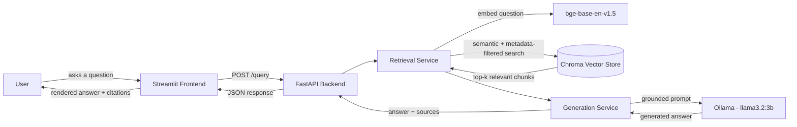

# 💊 RAG-Powered Drug Leaflet Assistant

A retrieval-augmented generation (RAG) web application that answers questions about drug dosage, warnings, interactions, and side effects — grounded strictly in official FDA/DailyMed package insert leaflets, with cited sources for every answer.

Built as a graduation project for a Level 2 AI/ML Summer Training program.

## Overview

This assistant retrieves relevant passages from a curated collection of 30 real drug package inserts (sourced from the FDA's DailyMed database) and uses a locally-run LLM (via Ollama) to generate answers grounded only in that retrieved context — never from the model's own general knowledge. Every answer is returned alongside the specific drug and label section it was sourced from, and the system is designed to explicitly decline to answer rather than hallucinate when the retrieved context doesn't contain enough information.

## Architecture



The vector store itself is built offline, once, by a Jupyter notebook (`notebooks/rag_pipeline.ipynb`) that handles data collection, chunking, embedding, and evaluation — the backend only loads and queries the already-built store at runtime; it never re-chunks or re-embeds anything live.

## Tech Stack

| Layer | Technology |
|---|---|
| Notebook / pipeline | Jupyter (Google Colab), pandas |
| Embeddings | `sentence-transformers` (`BAAI/bge-base-en-v1.5`) |
| Vector store | ChromaDB (persistent, local) |
| LLM | Ollama (`llama3.2:3b`), run locally |
| Backend | FastAPI, Pydantic, Uvicorn |
| Frontend | Streamlit |
| Testing | pytest, httpx |
| Data source | FDA DailyMed API |

## Project Structure

```
rag-assistant-project/
├── notebooks/
│   └── rag_pipeline.ipynb       # data collection, chunking, embeddings, evaluation
├── backend/
│   ├── app/
│   │   ├── main.py              # FastAPI app entrypoint, CORS
│   │   ├── api/routes/query.py  # GET /health, POST /query
│   │   ├── core/config.py       # settings loaded from .env
│   │   ├── schemas/query.py     # request/response models
│   │   └── services/
│   │       ├── retrieval.py     # embedding + Chroma retrieval logic
│   │       └── generation.py    # prompt template + Ollama call
│   ├── data/vector_store/       # persisted Chroma store (built by the notebook)
│   ├── tests/test_query.py
│   ├── requirements.txt
│   ├── .env.example
│   └── Dockerfile
├── frontend/
│   ├── app.py                   # Streamlit chat interface
│   ├── api_client.py            # backend API wrapper
│   ├── .env
│   └── requirements.txt
└── README.md
```

## Domain & Data

The corpus consists of **30 real drug package insert leaflets**, collected programmatically from the [FDA DailyMed](https://dailymed.nlm.nih.gov) API, spanning:

- Pain relief / NSAIDs (ibuprofen, aspirin, naproxen, diclofenac, acetaminophen)
- Antibiotics (amoxicillin, azithromycin, ciprofloxacin, doxycycline, metronidazole)
- Cardiovascular (lisinopril, amlodipine, losartan, metoprolol, atorvastatin)
- Diabetes (metformin, glipizide, insulin glargine, sitagliptin)
- Allergy/respiratory (cetirizine, loratadine, albuterol, montelukast)
- Mental health/neuro (sertraline, fluoxetine, alprazolam, gabapentin)
- GI and other common medications (omeprazole, loperamide, levothyroxine)

The corpus includes both **prescription (SPL)** and **OTC (Drug Facts)** label formats, which use different section header conventions — the chunking pipeline detects and handles both.

Full data collection and preprocessing details, including two real data-quality issues discovered and fixed during development, are documented in `notebooks/rag_pipeline.ipynb`.

## Setup

### Prerequisites
- Python 3.10+
- Ollama installed and running locally (https://ollama.com)
- Git

### 1. Clone the repository

```bash
git clone https://github.com/Ahmeduser123/rag-assistant-app.git
cd rag-assistant-app
```

### 2. Build the vector store (run the notebook)

The backend expects a pre-built vector store at `backend/data/vector_store/`. Open `notebooks/rag_pipeline.ipynb` (locally or in Google Colab) and run it top to bottom — it will collect the source PDFs, chunk them, generate embeddings, and persist the vector store to that path.

> Note: the raw PDFs and built vector store are excluded from this repository via `.gitignore` (kept small/reproducible on purpose) — running the notebook regenerates them from scratch.

### 3. Backend setup

```bash
cd backend
pip install -r requirements.txt
cp .env.example .env

ollama pull llama3.2:3b

uvicorn app.main:app --reload
```

Backend runs at http://localhost:8000. Interactive API docs: http://localhost:8000/docs

### 4. Frontend setup

In a separate terminal:

```bash
cd frontend
pip install -r requirements.txt

streamlit run app.py
```

Frontend runs at http://localhost:8501.

## Environment Variables

**Backend (`backend/.env`)**

| Variable | Default | Description |
|---|---|---|
| `VECTOR_STORE_DIR` | `data/vector_store` | Path to the persisted Chroma store |
| `COLLECTION_NAME` | `drug_leaflets` | Chroma collection name |
| `EMBEDDING_MODEL_NAME` | `BAAI/bge-base-en-v1.5` | Must match the model used to build the vector store |
| `OLLAMA_MODEL` | `llama3.2:3b` | Local LLM used for generation |
| `TOP_K` | `5` | Number of chunks retrieved per question |
| `FRONTEND_ORIGIN` | `http://localhost:8501` | Allowed CORS origin |

**Frontend (`frontend/.env`)**

| Variable | Default | Description |
|---|---|---|
| `API_BASE_URL` | `http://localhost:8000` | Backend URL the frontend calls |

## API Reference

### GET /health

Health check.

```bash
curl http://localhost:8000/health
```

Response:
```json
{"status": "ok"}
```

### POST /query

Ask a question, grounded in the drug leaflet corpus.

```bash
curl -X POST http://localhost:8000/query \
  -H "Content-Type: application/json" \
  -d '{"question": "What is the recommended dosage of metformin for adults?"}'
```

Response:
```json
{
  "answer": "The recommended starting dose of Metformin Hydrochloride Tablets for adults is 500 mg orally twice a day or 850 mg once a day, given with meals.\n\nSource: Metformin — Dosage And Administration — 2.1",
  "sources": [
    {"drug": "metformin", "section": "DOSAGE AND ADMINISTRATION"}
  ]
}
```

## Evaluation Results

Tested against 10 sample questions spanning dosage, warnings, interactions, storage, and contraindications. Full methodology and results table in `notebooks/rag_pipeline.ipynb`, section 2.6.

**Summary: 9/10 fully correct, 1/10 partially correct** (content accurate, minor citation label mismatch).

Two real issues were found and fixed during development:

1. **Cross-drug retrieval contamination** — questions naming a specific drug occasionally retrieved chunks from a different, semantically-similar drug (e.g. NSAIDs sharing near-identical warning language). Fixed by adding drug-name detection that hard-filters retrieval to the named drug when present in the question.
2. **Wrong source document** — the metformin dosage question initially returned a confusing answer, traced to a data collection bug where the DailyMed API's top search result for "metformin" was a combination drug (pioglitazone + metformin), not the plain single-ingredient label. Fixed by manually verifying and re-selecting the correct label.

The system correctly abstains ("no information available") rather than hallucinating when the retrieved sources genuinely don't answer the question — demonstrated on the amoxicillin/alcohol and levothyroxine missed-dose test questions.

## Screenshots

(Add screenshots of the running Streamlit app here before submission — a question being asked, the grounded answer, and the expanded sources section.)

## Known Limitations

- Corpus is limited to 30 drugs; questions about medications outside this set will correctly return "no information available" rather than an answer.
- Retrieval occasionally ranks a technically-correct but less specific section above the most precise one (observed once in evaluation, on the metformin dosage question) — a minor ranking nuance, not a grounding failure.
- Ollama generation speed depends on local hardware (GPU vs CPU); expect slower responses on CPU-only machines.